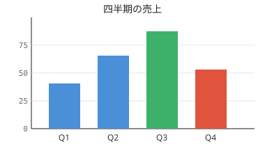
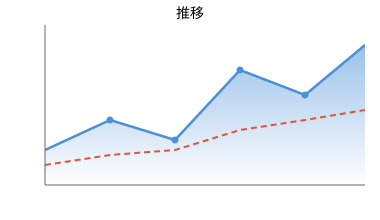
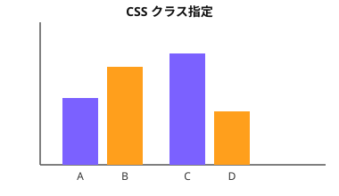
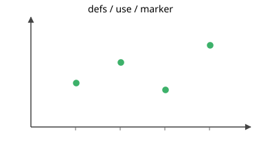
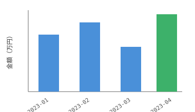
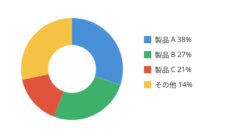
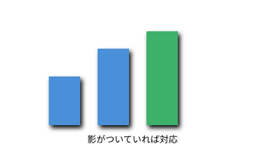
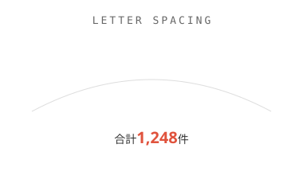

# SVG でグラフを描く — 対応範囲の実例

このフォルダの SVG は、グラフ SVG でよく使われる書き方が `SvgWpf`（SharpVectors 経由）で
描けるかを確かめるためのサンプルです。**このファイル自体を MdViewerApp で開くと、
Markdown に埋め込んだ SVG として表示されます。**

各 SVG は単体でも開けます（`.svg` を開くと `SvgViewer` で表示されます）。

---

## 1. 棒グラフ

`rect` / `line` / `text-anchor`、目盛線、日本語のラベルとタイトル。

## 2. 折れ線グラフ

`path` による折れ線と面塗り、`stroke-dasharray` の破線、`linearGradient` のグラデーション、
`clipPath` による描画範囲の切り抜き。

## 3. style 要素の CSS クラス

`<style>` の中でクラスを定義し、`class='bar'` のように指定する書き方です。
**D3 や Mermaid が書き出す SVG はこの形式が多いので、実用上とくに重要です。**
`fill` だけでなく `font-weight: bold` や `text-anchor` も効きます。

## 4. defs / use / symbol / marker

`marker` による軸の矢印、`symbol` と `use` による図形の再利用。

## 5. 入れ子の transform と回転ラベル

`translate` / `scale` の入れ子と、`rotate(-35)` の日付ラベル、`rotate(-90)` の Y 軸ラベル。
軸ラベルの回転はグラフでは頻出です。

## 6. 円グラフ

円弧（`A` コマンド）による扇形と、中央を白で抜いたドーナツ形、凡例。

## 7. フィルタ ― **非対応**

`feGaussianBlur` + `feOffset` + `feMerge` で棒に影を付けていますが、**影は描かれません**。
ただし棒そのものは正しく描かれます。効果が消えるだけで、図が壊れるわけではありません。

## 8. tspan / textPath / letter-spacing

曲線に沿ったテキスト、1 行の中で色や大きさを変える `tspan`、字間の指定。

## 9. foreignObject ― **非対応**

`foreignObject` の中の HTML は描かれません（枠だけが残ります）。
同じ SVG の中の通常の `text` は描かれます。

**Mermaid は既定でノードのラベルを `foreignObject` に入れます。** そのままだと
図形は出るのに文字だけ消えるので、Mermaid 側で `htmlLabels: false` を指定して
`text` 要素で書き出させてください。

## 10. SMIL アニメーション

`<animate>` が付いていてもエラーにはならず、属性値どおりの静止画として描かれます。
アニメーションはしません。ビューアなのでこれで十分という判断です。

---

## まとめ

| 書き方 | 対応 |
|---|---|
| `rect` `line` `circle` `path`（円弧含む） | 対応 |
| `text` / `tspan` / `textPath` / `text-anchor` / `letter-spacing` | 対応 |
| `linearGradient` / `stroke-dasharray` / `clipPath` | 対応 |
| `defs` / `use` / `symbol` / `marker` | 対応 |
| 入れ子の `g transform`（`translate` / `rotate` / `scale`） | 対応 |
| `<style>` の CSS クラス | 対応 |
| 日本語のラベル | 対応 |
| `filter`（影・ぼかし） | **非対応**（中身は描かれる。効果だけ消える） |
| `foreignObject`（HTML 埋め込み） | **非対応**（枠だけ残る） |
| SMIL `animate` | 静止画として描画（動かない） |

手書きのグラフ、matplotlib や Excel、Illustrator の SVG 書き出しは、いずれも
`text` 要素を使うので問題ありません。
