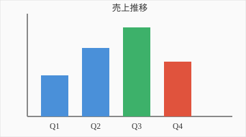

# 四半期レポート

このファイルは **SVG 画像を埋め込んだ Markdown** です。
`MdViewerApp` で開くと SVG も一緒に描画されます。

## 売上

相対パスで指定した SVG が表示されます。

| 四半期 | 売上 | 前年比 |
|--------|-----:|------:|
| Q1 | 120 | +5% |
| Q2 | 200 | +12% |
| Q3 | 260 | +18% |
| Q4 | 160 | -3% |

## メモ

- [x] グラフを差し替えた
- [ ] 来期の予測を追記する
- ~~旧フォーマットの表を削除~~ 完了

> **注意**: このビューアは表示専用です。編集はできません。

参考: https://commonmark.org/
